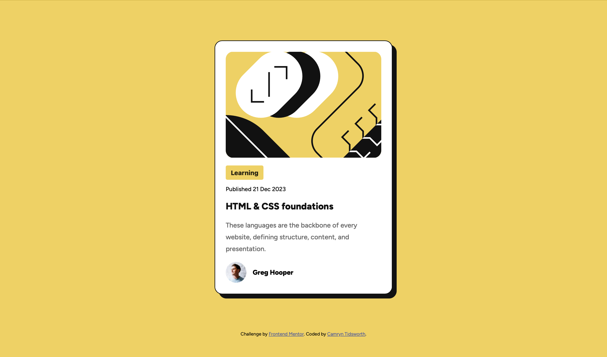

# Frontend Mentor - Blog preview card solution

This is a solution to the [Blog preview card challenge on Frontend Mentor](https://www.frontendmentor.io/challenges/blog-preview-card-ckPaj01IcS). Frontend Mentor challenges help you improve your coding skills by building realistic projects. 

## Table of contents

- [Overview](#overview)
  - [The challenge](#the-challenge)
  - [Screenshot](#screenshot)
  - [Links](#links)
- [My process](#my-process)
  - [Built with](#built-with)
  - [What I learned](#what-i-learned)
  - [Continued development](#continued-development)
- [Author](#author)

## Overview

### The challenge

Users should be able to:

- See hover and focus states for all interactive elements on the page

### Screenshot

### Links

- Solution URL: [Add solution URL here](https://your-solution-url.com)
- Live Site URL: [Add live site URL here](https://your-live-site-url.com)

## My process

### Built with

- Semantic HTML5 markup
- CSS custom properties
- Flexbox

### What I learned

I used CSS custom properties for the first time and found that they help streamline my workflow and clarify my code significantly. I also got some more practice with adding hover states, which I enjoy. 

### Continued development

This project touched on several important skills including CSS flexbox, CSS custom properties, and adding interactive elements to CSS. In the future, I would like to apply these skills to more complex projects.

## Author

- Frontend Mentor - [@CamrynTidsworth](https://www.frontendmentor.io/profile/CamrynTidsworth)
